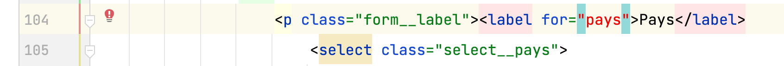

_# Grille d'évaluation pour le TP3
## Structure, sémantique, accessibilité, API des formulaires HTML5
- [X] __Regrouper les éléments de formulaire de même nature__ (1 point)
    - Utiliser des `<fieldsets>`
    - Faire des groupes d’`<option>`s dans une liste déroulante
- [X] __Étiqueter__ (0.75/1 point)
    - Étiqueter les groupes d’éléments de formulaire
    - Nommer chaque groupe avec une `<legend>`
    - Étiqueter un groupe d’`<option>`s d’une liste déroulante
    - Étiqueter avec un `<label>` les champs de formulaire
- [X] __Tester l'accessibilité__ (1 point)
    - Rendre (garder) le formulaire navigable au clavier
    - Baliser avec précision les éléments de formulaire
    - Bien choisir le type du `<input>`
    - Code sémantique et valide pour l’ensemble du document
- [X] __Ajouter des containtes de saisie__ (.8/1 point)
    - Identifier par un attribut approprié les champs obligatoires du formulaire
    - Ajouter des contraintes de saisie sur les champs de formulaire

## Styles CSS
- [X] __Aligner les éléments de formulaire__ (0.65/1 point)
    - Contrôler les espacements
- [X] __Intégrer tous les contenus__  (0.65/1 point)
    - Selon les guides visuels (ou mieux !)
- [X] __Styler l’interactivité__  (0.5/1 point)
    - État focus, état checked des éléments de formulaires
    - États des hyperliens (link, visited, hover, active)
    - Styler les messages d’erreur
    - Utiliser des sprites CSS
- [X] __Styler les boutons radio__  (0.5/1 point)
    - en les gardant accessibles au clavier

## Méthodes de travail favorisant la collaboration
- [X] __Organiser et documenter la feuille de styles__  (0.5/1 point)
- [X] __Utiliser le contrôle des versions GIT__  (1 point)
    - Un minimum de 3 commits est attendu pour les étapes html, css, contrôle qualité finale


## Note et commentaires
<span style='color:red'> 7.35/10 </span>

- Nettoyer le répertoire du projet. 
Supprimer les fichiers inutiles pour le Web. 
- Plusieurs [erreurs html](images/erreurs-html.png)
  - Encore les `<br>`
  - Les regroupements d'option, les `<optgroup>` n'étaient pas fermés correctement

### Accessibilité
- L'étiquetage est défectueux pour le "pays" et pour le "mois"


### CSS
- Trop de balise ``<link>`` vers les fichiers CSS qui sont ainsi reliés en double puisqu'il y a des instructions `@import` dans le fichier styles.css
- Les instructions `@import` doivent être placées au début du fichier CSS
avant de commencer à écrire des règles. Pour s'en assurer, je suggère de déplacer les *Utilitaires* sous la dernière importation, celle de la grille.
- Utiliser la classe ``screen-reader-only`` pour cacher les boutons radio
- Placer les utilitaires regroupés au début de la CSS. Les utilitaires comporte les règles pour le `box-sizing`, 
les classes de l'accessibilité `screen-reader-only` ainsi que certaines règles de base comme celle qui permet de fluidifier les images.
```css
img{
    max-width: 100%;
}
```

### Fonctionnalités
- Les boutons radio ne forment pas un groupe mutuellement exclusif car la valeur de leur attribut `name` n'est pas la même. Ils ont la valeur de leur `name` est la même que celle de leur `id`
Voir les corrections dans le code du commit.

## Barème
| Barème | sur 1 |
|--------|-------|
| A+     | 1     |
| A      | 0.95  |
| B+     | 0.9   |
| B      | 0.85  |
| C+     | 0.8   |
| C      | 0.75  |
| D      | 0.65  |_
